[中文](README.md) | [English](README_EN.md)

# Hello Bullet zombie
v1.1.0.cn.sy.202508010128

### v1.1.0.cn.sy.202508010128 正式发布版 🔥🔥🔥🔥🔥🔥🔥🔥
Hi，😊Bullet zombie v1.1.0.cn.sy.202508010128 正式版已发布，希望 Bullet zombie 这款游戏能为大家带来一些灵感和帮助，感谢您的认可与支持！游戏视频介绍：[传送门](https://www.bilibili.com/video/BV1M58wz2Ehb/?vd_source=4935fce829bc1535d641a4e735b2349f)

### Bullet zombie v2.1.0-beta.1 全新版本 🚀🚀
Hi，😊Bullet zombie v2.1.0-beta.1 迎来全新版本升级！
新增：1.多人在线模式 2.多人世界聊天 3.寻宝系统 4.背包系统 5.更多的随机装备（装备交互/描述）

### Bullet zombie 介绍
Hi，😊欢迎您品鉴 Bullet zombie 休闲游戏，这是一款基于 Enable3D As 3D Extension for Phaser 引擎架构的休闲游戏。如果您一直从事Web前端开发工作并且厌倦了铺页面的日子又对游戏图形方面感兴趣却无从下手时，那么您不妨来玩一玩 Bullet zombie 休闲游戏。

### Bullet zombie 内容
Bullet zombie 休闲游戏的出发点是作为从事Web前端开发人员推荐用于教学和非商业项目为目的。Game Graphics 内容包括 2D Graphics、3D Graphics、Physics。Project Code 比较丰富，涵盖平时开发人员开发中的一些常用方法逻辑并封装💻，如：自动寻路模块，Player作战模块，生物状态模块，消息模块，装备掉落/拾取模块，动画管理模块，技能树模块，生物（小怪/BOSS）刷新模块，AI模型训练决策模块等。希望 Bullet zombie 休闲游戏可以作为您游戏图形入门的首选。

### Bullet zombie 素材
-  [kenney](https://kenney.nl/assets)
-  GameUI over icon by Alibaba Iconfont author StarZhang (Source: [https://www.iconfont.cn/])
-  GameUI save icon by Alibaba Iconfont author EOMOICONS (Source: [https://www.iconfont.cn/])
-  GameUI backpack icon by Alibaba Iconfont author EOMOICONS (Source: [https://www.iconfont.cn/])
-  GameUI chat user icon by Alibaba Iconfont author xiaoliang1314 (Source: [https://www.iconfont.cn/])
-  GameUI other icon by game-icons (Source: [https://game-icons.net/]) CC BY 3.0.
-  GameModel Brain/Brain.glb by author arifhas (Source: [https://sketchfab.com/3d-models/brain-e45c5753fdbf4b99b96f2c110622b945]) CC BY 4.0.

### Bullet zombie 库 🔗
-  [vue](https://vuejs.org/)  -front end.
-  [nest.js](https://nestjs.com/)  -backend.
-  [enable3d.io](https://enable3d.io/)  -engine. (Source: [https://github.com/enable3d/enable3d]) LGPL-3.0.
-  [phaser.io](https://phaser.io/)  -engine.
-  [THREE.js](https://threejs.org/)  -engine.
-  [gsap](https://gsap.com/)  -core.
-  [vue-beautiful-chat](https://matteo.merola.co/vue-beautiful-chat/)  -core.
-  [naiveui](https://www.naiveui.com/zh-CN/os-theme)  -core.
-  [brain.js](https://brain.js.org/#/)  -core.
-  [socket.io](https://socket.io/)  -core.
-  [ioredis](https://github.com/luin/ioredis)  -core.
-  [recast-navigation-js](https://github.com/isaac-mason/recast-navigation-js)  -core.

### Bullet zombie Core code 目录结构
#### front end v2.1.0-beta.1
```
📦 App
├── 📂 src
│   ├── 📂 config
│   │   └── 📄 host.js
│   ├── 📂 utils
│   │   ├── 📄 HtmlSubscription.js
│   │   ├── 📄 LinkedList.js
│   │   └── 📄 Socket.js
│   └── 📂 views
│       └── 📂 Game
│           ├── 📄 GameHandheld.js
│           ├── 📄 GameIndex.vue
│           └── 📄 GameScene.js
├── 📄 package.json
└── 📄 README.md
```
#### backend v2.1.0-beta.1
```
📦 Service
├── 📂 logs
├── 📂 src
│   ├── 📂 TemplateApi
│   │   ├── 📂 TemplateApiAlService
│   │   │   └── 📄 TemplateApiAl.service.ts
│   │   ├── 📂 TemplateApiGameService
│   │   │   └── 📄 TemplateApiGame.service.ts
│   │   ├── 📂 TemplateApiGameSocketRoom
│   │   │   └── 📄 TemplateApiGame.room.ts
│   │   ├── 📂 TemplateApiGateway
│   │   │   └── 📄 TemplateApiChat.gateway.ts
│   │   └── 📂 TemplateApiPlugService
│   │       ├──📄 TemplateApiController.ts
│   │       ├──📄 TemplateApi.dto.ts
│   │       ├──📄 TemplateApi.entity.ts
│   │       ├──📄 TemplateApi.module.ts
│   │       ├──📄 TemplateApi.service.ts
│   │       └──📄 TemplateApiSocketIoClient.service.ts 🚀
│   ├── 📂 utils
│   │   ├── 📄 uploads.type.ts
│   │   └── 📄 winston.config.ts
│   ├── 📄 app.controller.ts
│   ├── 📄 app.module.ts
│   └── 📄 main.ts
├── 📂 static
│   ├── 📂 AI
│   │   ├── 📄 GhostTrainData.json
│   │   ├── 📄 GhostFinalDecision.json 🚀
│   │   └── 📄 GhostBehavioralDecisionMakingData.json 🚀
│   └── 📂 game
│       ├── 📂 ammo
│       ├── 📂 images
│       ├── 📂 models
│       └── 📄 save.json
├── 📄 config.yml 🚀
├── 📄 Dockerfile
├── 📄 package.json
└── 📄 README.md
```
### Multiplayer Online Service backend v2.1.0-beta.1
```
📦 MultiplayerOnlineService
├── 📂 logs
├── 📂 src
│   ├── 📂 TemplateApi
│   │   └── 📂 TemplateApiGameSocketRoom
│   │       └── 📄 TemplateApiGame.room.ts
│   │       📂 TemplateApiGateway
│   │       └── 📄 TemplateApiChat.gateway.ts
│   ├── 📄 app.controller.ts
│   ├── 📄 app.module.ts
│   └── 📄 main.ts
├── 📄 config.yml 🚀
├── 📄 Dockerfile
├── 📄 package.json
└── 📄 README.md
```
### Bullet zombie 流程时序
#### 登录流程时序 v1.0.0-beta.1
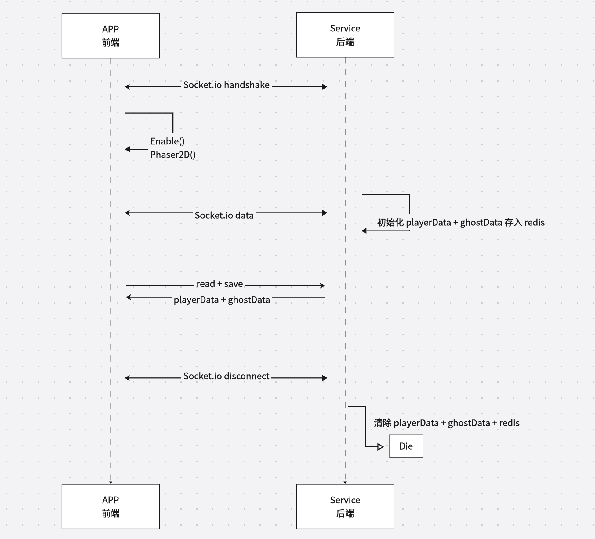

#### 多人在线流程时序 v2.1.0-beta.1
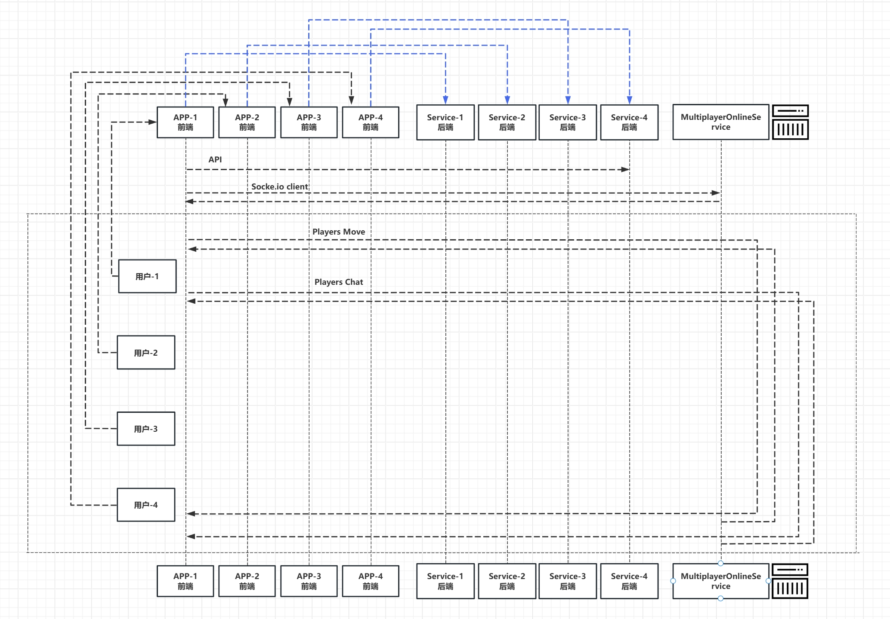

#### 其他部分流程时序 v1.0.0-beta.1
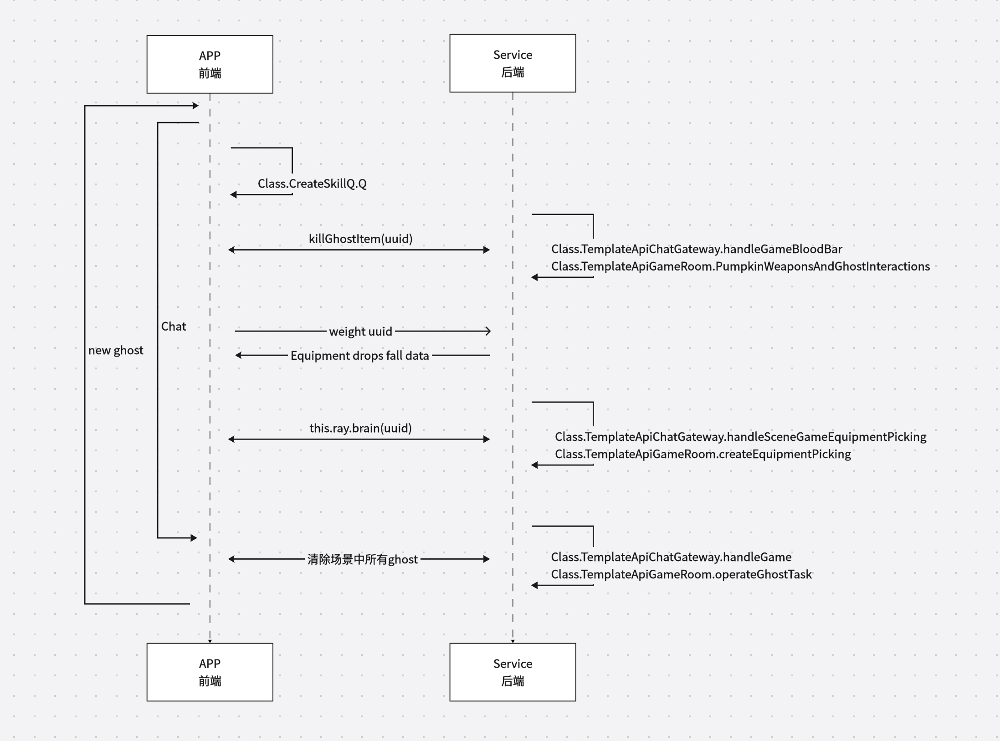

### 多人在线架构 v2.1.0-beta.1
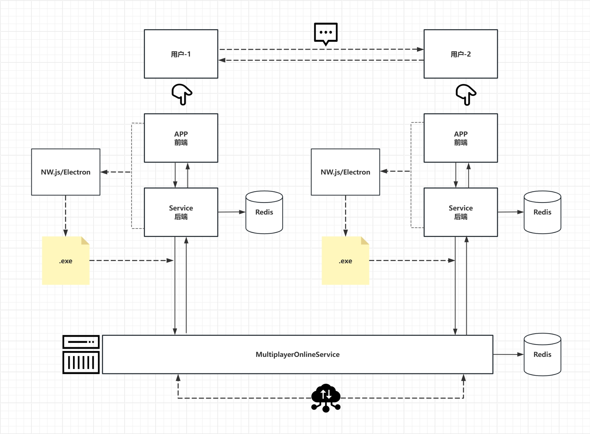

### 多人在线架构（重构） v2.1.0-beta.1
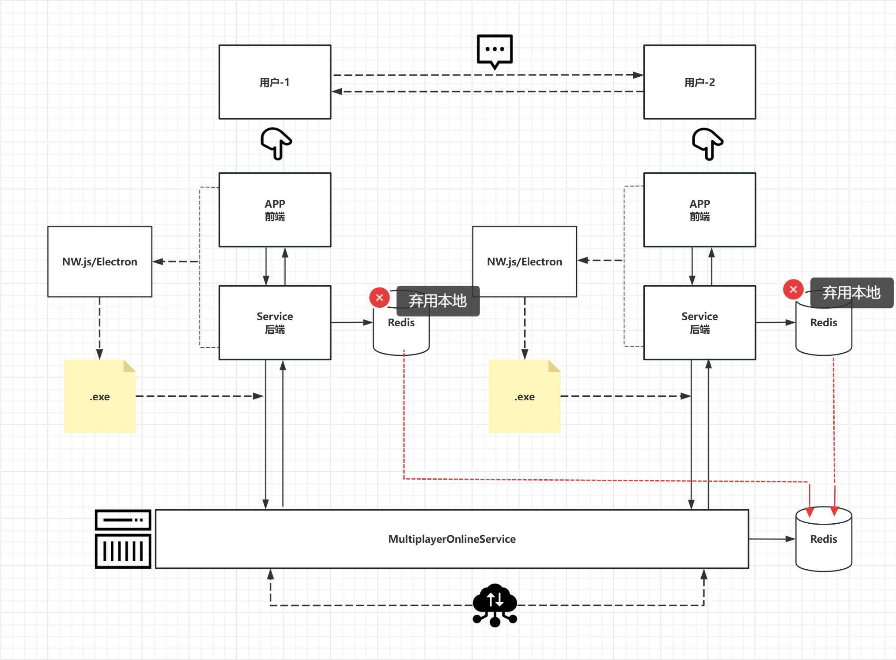

### Bullet zombie 场景架构 🎨
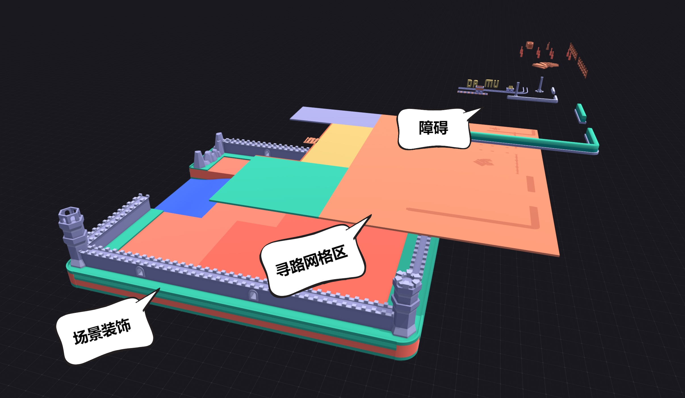

### Bullet zombie 运行视频预览 🎬
#### 传送门
[游戏视频介绍](https://www.bilibili.com/video/BV1M58wz2Ehb/?vd_source=4935fce829bc1535d641a4e735b2349f)

### Bullet zombie 部分开发进度预览 📷
#### Bullet zombie Game combat system v2.1.0-beta.1
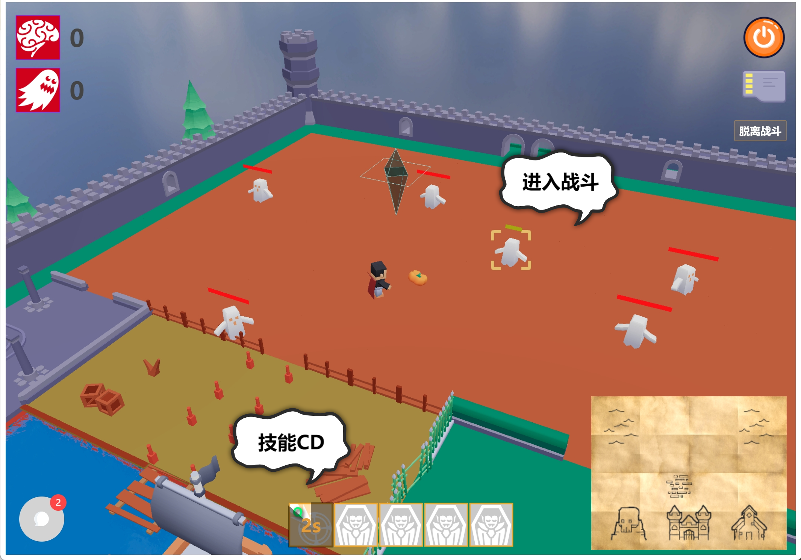

#### Bullet zombie GameScene Equipment drop system v2.1.0-beta.1
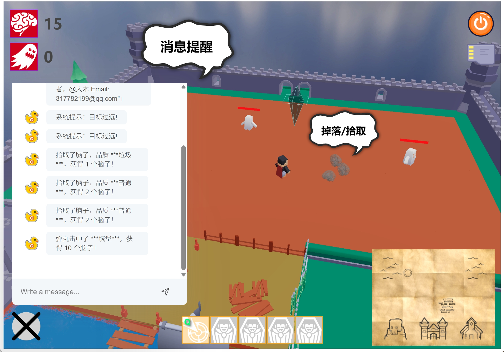

#### Bullet zombie GameScene AI model training decision system v2.1.0-beta.1
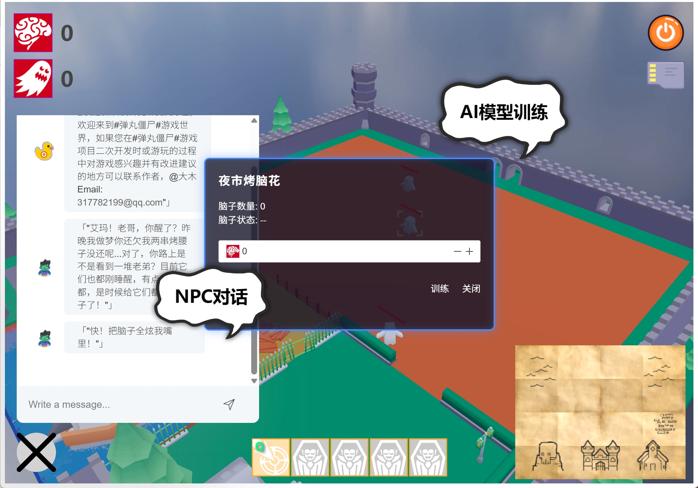

#### Bullet zombie GameScene backpack system v2.1.0-beta.1
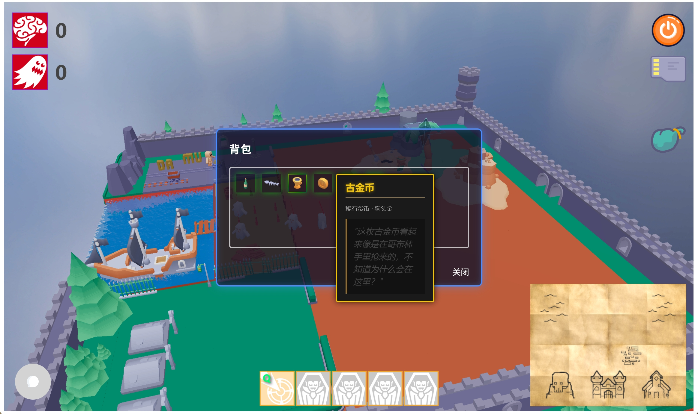

#### Bullet zombie GameScene Treasure Hunt system v2.1.0-beta.1
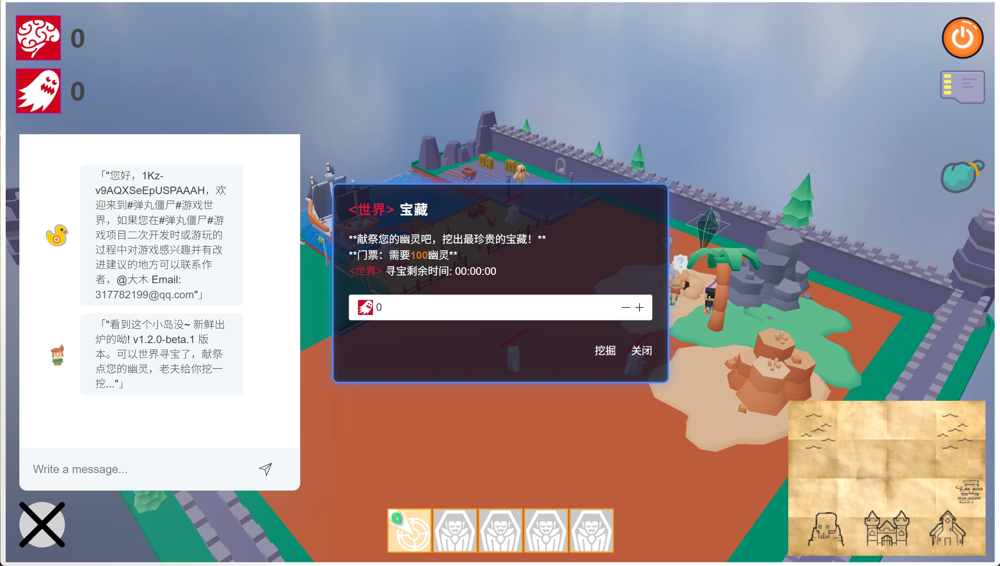

#### Bullet zombie GameScene Treasure Multiplayer online system v2.1.0-beta.1
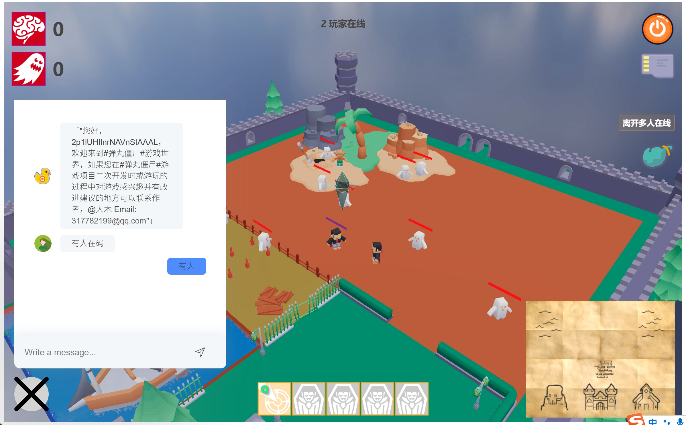

#### Bullet zombie Archive Modifier v1.2.3.rc
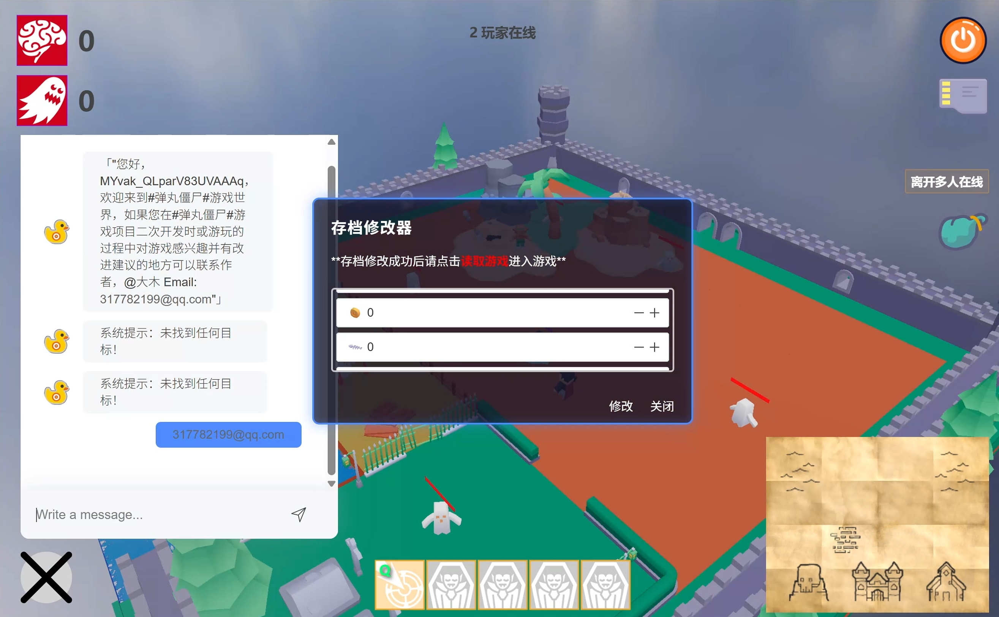

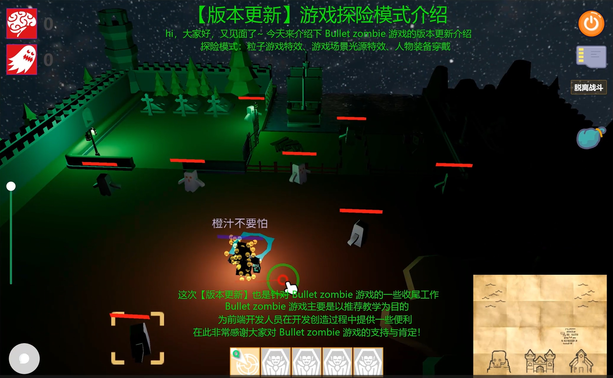

### Bullet zombie install
#### App ⚠️(Note: Installing Brain.js requires compilation in other environments such as Python. Please refer to the official website for details. Advise‌ node version 16.20.1)
```
cd App
npm i
npm run dev

cat src/config/host.js
```
#### Service
```
cd Service
npm i
npm run dev

cat .env
```
#### Multiplayer online Service
```
cd MultiplayerOnlineService
npm i
npm run dev

cat .env
```
#### Multiplayer online Service deploy
```
cd MultiplayerOnlineService
cat Dockerfile

# Linux Dockerfile
docker build -t bullet-zombie:v1.1.0.online.1 .
# develop
# docker run -itd --network=host --name bz-service bullet-zombie:v1.1.0.online.1
docker run -itd -p 1868:1868 --name bz-service bullet-zombie:v1.1.0.online.1
docker images
docker ps -a

# online config.yml
cat config.yml
```

### 🌟模块
- [x] **自动寻路 v2.1.0-beta.1**
- [x] **装备掉落/拾取 v2.1.0-beta.1**
- [x] **动画管理 v2.1.0-beta.1**
- [x] **生物状态 v2.1.0-beta.1**
- [x] **生物（小怪/BOSS）刷新 v2.1.0-beta.1**
- [x] **Player作战 v2.1.0-beta.1**
- [x] **Player状态 v2.1.0-beta.1** 🚀
- [x] **技能树 v1.0.0-beta.1**
- [x] **消息Chat v2.1.0-beta.1**
- [x] **物理 v2.1.0-beta.1**
- [x] **AI模型训练 v2.1.0-beta.1**
- [x] **Ghost决策 v2.1.0-beta.1** 🚀
- [X] **Ghost作战 v1.0.0-beta.1** 🚀
- [X] **背包 v2.1.0-beta.1** 🚀
- [X] **寻宝 v2.1.0-beta.1** 🚀
- [ ] **天气**
- [X] **昼夜**
- [x] **多人在线 v2.1.0-beta.1** 🚀🚀
- [x] **方方面面的你这不得优化优化啊** 🔥🔥

### Beta
#### 1. 对于场景拾取精度优化调整 v1.0.0.beta.1
#### 2. 对于v2.0.0-beta.1全新版本更新迭代前期剩余已知BUG问题修复 v2.0.0.beta.1
#### 3. 多人在线数据重构，优雅处理数据，代码优化，针对代码优化期间所发现/产生的BUG问题修复 v2.1.0.beta.1

### rc
#### 1. 预发布版，针对 v1.0.0.beta.1 - v2.1.0.beta.1 历代版本更新迭代全面优化，对于优化期间所发现/产生的BUG问题修复 v1.0.0.rc
#### 2. 预发布版，新增光标，AI模型训练接口超时BUG问题修复，移动距离优化，技能振幅优化 v1.1.1.rc
#### 3. 预发布版，新增存档修改器、场景镜头缩放，读取游戏无法获取玩家名称BUG问题修复，多人在线参与者玩家退出多人在线时玩家镜像和名称不消失BUG问题修复 v1.2.3.rc
#### 4. v1.2.3.rc 封版

### v1.1.0.cn.sy.202508010128
#### 1. 正式发布版 v1.1.0.cn.sy.202508010128


### 💖支持项目
如果这个项目对您有帮助，欢迎 **Star** 或 **Fork**！您的鼓励是我前进的动力，感谢您的认可！😊